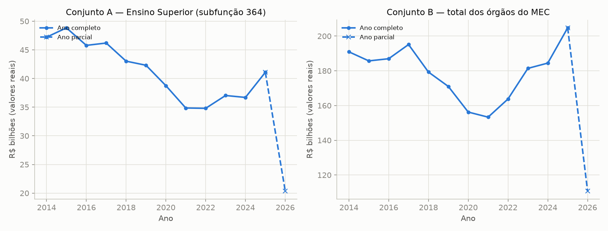
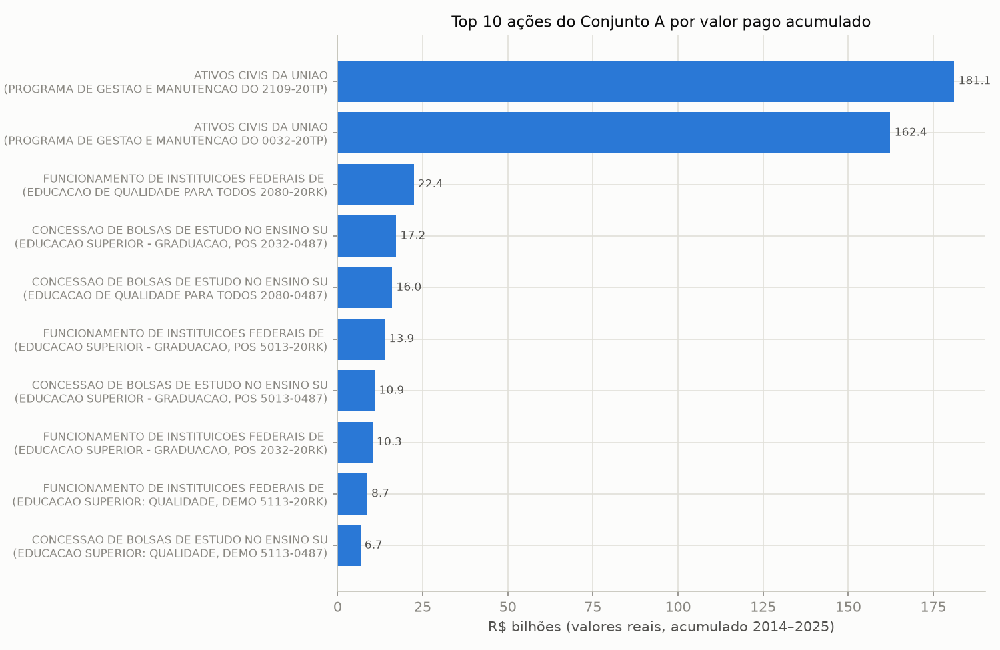
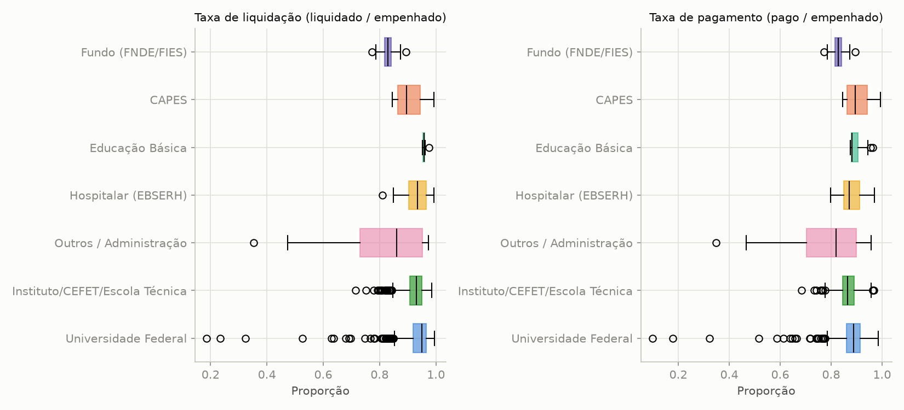
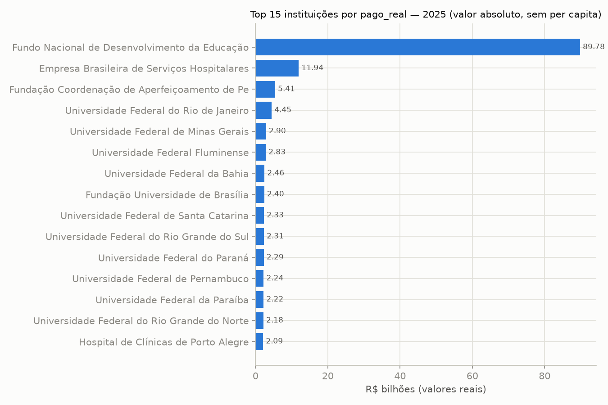

# Análise exploratória com foco em anomalias — tarefa 2.1

Gerado por `analises/02_eda.py`. Base: `dados/*_v2.{csv,parquet}` (Fase 1
— deduplicado, deflacionado, ano parcial/séries curtas marcados). Todos os
valores monetários abaixo são **reais** (`pago_real`, R$ de 2025),
não nominais.

## 1. Evolução do total pago por ano

**Leitura:** a linha tracejada marca o ano parcial (2026) — não deve ser
lida como queda de gasto, só cobertura incompleta do exercício (ver
`CLAUDE.md`). Nos anos completos, ambos os conjuntos mostram uma trajetória
em U: queda real entre 2017/2018 e o piso em **2021** (Conjunto B: R$ 195,1
bi em 2017 → R$ 153,3 bi em 2021, -21,4% em termos reais), seguida de
recuperação sustentada até 2025 (R$ 204,7 bi, novo máximo da série). O
Conjunto A (só subfunção 364) segue a mesma forma em U, com piso também em
2021 (R$ 34,8 bi) e mais volatilidade ano a ano — esperado, dado que é uma
fração específica do orçamento do MEC, mais sensível a mudanças de
programa/ação do que o total institucional do Conjunto B.

## 2. Top 10 ações do Conjunto A por valor acumulado (2014–2025)

| codigoPrograma   | programa                                                                  | codigoAcao   | acao                                                      | pago_real_bi_2014_2025   |
|:-----------------|:--------------------------------------------------------------------------|:-------------|:----------------------------------------------------------|:-------------------------|
| 2109             | PROGRAMA DE GESTAO E MANUTENCAO DO MINISTERIO DA EDUCACAO                 | 20TP         | ATIVOS CIVIS DA UNIAO                                     | 181.14                   |
| 0032             | PROGRAMA DE GESTAO E MANUTENCAO DO PODER EXECUTIVO                        | 20TP         | ATIVOS CIVIS DA UNIAO                                     | 162.37                   |
| 2080             | EDUCACAO DE QUALIDADE PARA TODOS                                          | 20RK         | FUNCIONAMENTO DE INSTITUICOES FEDERAIS DE ENSINO SUPERIOR | 22.37                    |
| 2032             | EDUCACAO SUPERIOR - GRADUACAO, POS-GRADUACAO, ENSINO, PESQUISA E EXTENSAO | 0487         | CONCESSAO DE BOLSAS DE ESTUDO NO ENSINO SUPERIOR          | 17.22                    |
| 2080             | EDUCACAO DE QUALIDADE PARA TODOS                                          | 0487         | CONCESSAO DE BOLSAS DE ESTUDO NO ENSINO SUPERIOR          | 16.04                    |
| 5013             | EDUCACAO SUPERIOR - GRADUACAO, POS-GRADUACAO, ENSINO, PESQUISA E EXTENSAO | 20RK         | FUNCIONAMENTO DE INSTITUICOES FEDERAIS DE ENSINO SUPERIOR | 13.90                    |
| 5013             | EDUCACAO SUPERIOR - GRADUACAO, POS-GRADUACAO, ENSINO, PESQUISA E EXTENSAO | 0487         | CONCESSAO DE BOLSAS DE ESTUDO NO ENSINO SUPERIOR          | 10.95                    |
| 2032             | EDUCACAO SUPERIOR - GRADUACAO, POS-GRADUACAO, ENSINO, PESQUISA E EXTENSAO | 20RK         | FUNCIONAMENTO DE INSTITUICOES FEDERAIS DE ENSINO SUPERIOR | 10.27                    |
| 5113             | EDUCACAO SUPERIOR: QUALIDADE, DEMOCRACIA, EQUIDADE E SUSTENTABILIDADE     | 20RK         | FUNCIONAMENTO DE INSTITUICOES FEDERAIS DE ENSINO SUPERIOR | 8.71                     |
| 5113             | EDUCACAO SUPERIOR: QUALIDADE, DEMOCRACIA, EQUIDADE E SUSTENTABILIDADE     | 0487         | CONCESSAO DE BOLSAS DE ESTUDO NO ENSINO SUPERIOR          | 6.72                     |

**Leitura:** as duas maiores linhas — juntas, ~R$ 343 bi acumulados em
2014–2025, mais que a soma de todas as outras oito do top 10 — são a mesma
ação orçamentária genérica, "Ativos Civis da União" (folha de pagamento de
servidores ativos), classificada sob dois programas orçamentários
diferentes. Ou seja: **a maior parte da despesa etiquetada como subfunção
"Ensino Superior" no Conjunto A é folha de pessoal**, não bolsas nem
custeio de funcionamento — um achado relevante para interpretar qualquer
"salto" nessa ação como possivelmente ligado a reajuste salarial/plano de
carreira, não a um evento pontual de gasto. As demais posições do top 10
são consistentes com o escopo temático esperado (bolsas de estudo,
funcionamento das IFES) — não há, nesta lista, nenhuma ação fora do tema da
subfunção 364.

## 3. Distribuição de taxas de execução por tipo de instituição (Conjunto B)

**Leitura:** a mediana de `taxa_pagamento` fica entre 83% e 90% em todos os
tipos de instituição — grupos comparáveis no centro da distribuição.
A dispersão é o que diferencia: `Outros / Administração` tem a caixa mais
larga (25º percentil em 70%, mínimo em 35%) — categoria heterogênea (poucos
órgãos, sem um perfil orçamentário único), consistente com maior variação
esperada. `Universidade Federal` e `Instituto/CEFET/Escola Técnica`, os
dois grupos com mais observações (791 e 480 linhas-ano), têm a caixa
(25º–75º percentil) estreita e comparável entre si (~0,84–0,91), mas
exibem vários **outliers de baixa execução** (círculos isolados abaixo de
0,5, com um mínimo de 0,098 em Universidade Federal) — órgãos/anos
específicos que pagaram uma fração muito menor do empenhado que o restante
do grupo. Esses pontos são candidatos naturais para checagem cruzada com
as tarefas 2.3–2.5 (não investigados individualmente nesta seção).

## 4. Ranking de instituições por pago_real — 2025 (valor absoluto)

| orgao                                                                | tipo_instituicao     | pago_real_bi_2025   |
|:---------------------------------------------------------------------|:---------------------|:--------------------|
| Fundo Nacional de Desenvolvimento da Educação                        | Fundo (FNDE/FIES)    | 89.78               |
| Empresa Brasileira de Serviços Hospitalares                          | Hospitalar (EBSERH)  | 11.94               |
| Fundação Coordenação de Aperfeiçoamento de Pessoal de Nível Superior | CAPES                | 5.41                |
| Universidade Federal do Rio de Janeiro                               | Universidade Federal | 4.45                |
| Universidade Federal de Minas Gerais                                 | Universidade Federal | 2.90                |
| Universidade Federal Fluminense                                      | Universidade Federal | 2.83                |
| Universidade Federal da Bahia                                        | Universidade Federal | 2.46                |
| Fundação Universidade de Brasília                                    | Universidade Federal | 2.40                |
| Universidade Federal de Santa Catarina                               | Universidade Federal | 2.33                |
| Universidade Federal do Rio Grande do Sul                            | Universidade Federal | 2.31                |
| Universidade Federal do Paraná                                       | Universidade Federal | 2.29                |
| Universidade Federal de Pernambuco                                   | Universidade Federal | 2.24                |
| Universidade Federal da Paraíba                                      | Universidade Federal | 2.22                |
| Universidade Federal do Rio Grande do Norte                          | Universidade Federal | 2.18                |
| Hospital de Clínicas de Porto Alegre                                 | Hospitalar (EBSERH)  | 2.09                |

**Ressalva importante (a mais relevante desta seção):** o primeiro
colocado, FNDE (R$ 89,78 bi — 7,5× o segundo colocado), não deve ser lido
como "a maior despesa de ensino superior": o Conjunto B traz o total do
órgão em **todas as funções**, e o FNDE administra programas nacionais de
educação básica (merenda escolar, material didático, transporte escolar)
além de FIES — a maior parte desse valor provavelmente não é ensino
superior. Essa é exatamente a ressalva já registrada em `CLAUDE.md`
("Conjunto B não permite concluir gasto com ensino superior da
instituição"); o Conjunto A (subfunção 364) é a fonte correta para valores
especificamente de ensino superior. Adicionalmente, este ranking é por
valor **absoluto**, não per capita — não há ainda dado de matrícula por IES
incorporado (tarefa 4.1, que depende do Censo da Educação Superior/INEP,
ver `EXTERNAL.md`, item E3).

## 5. Linhas já flageadas (`flag_anomalia=True`)

Conjunto A: 19 linhas. Conjunto B: 58 linhas (dados
já tratados na Fase 1 — nenhuma delas é do ano parcial nem de série curta).
Leitura crítica: a maior parte dessas flags vem de `flag_anomalia_robusto`
e `flag_salto_anual`, ambas sensíveis a bases de comparação pequenas
mesmo dentro de séries com ≥5 anos — um salto real de política pública
(ex.: criação ou extinção de um programa) produz exatamente o mesmo sinal
estatístico que um erro de dado. A seção 6 abaixo prioriza as mais extremas
para checagem manual; a Fase 2.3–2.5 adiciona métodos complementares
(Isolation Forest, LOF, Benford, tendência robusta) para triangular esses
sinais antes de qualquer conclusão.

## 6. Candidatas a investigação (top 20)

Ordenadas por `|zscore_robusto_pago|` (maior desvio robusto em relação ao
histórico da própria série/instituição primeiro). `pago_real_mi` em R$
milhões, valores reais.

| conjunto   | entidade                                                          | ano   | pago_real_mi   | justificativa                                                                           |
|:-----------|:------------------------------------------------------------------|:------|:---------------|:----------------------------------------------------------------------------------------|
| B          | Universidade Federal do Cariri                                    | 2014  | 6.96           | sinais: zscore_robusto; z-score robusto de -10.9.                                       |
| B          | Universidade Federal do Sul e Sudeste do Pará                     | 2014  | 68.71          | sinais: zscore_robusto; z-score robusto de -9.4.                                        |
| B          | Universidade Federal do Oeste da Bahia                            | 2014  | 2.31           | sinais: zscore_robusto; z-score robusto de -9.2.                                        |
| A          | RECONSTRUCAO E MODERNIZACAO DO MUSEU NACIONAL                     | 2022  | 3.8            | sinais: zscore_robusto, salto_anual; variação anual de +16093%; z-score robusto de 8.9. |
| A          | CONCESSAO DE BOLSAS DE RESIDENCIA EM SAUDE                        | 2025  | 0.0            | sinais: zscore_robusto; z-score robusto de -7.7.                                        |
| A          | CONCESSAO DE BOLSAS DE RESIDENCIA EM SAUDE                        | 2024  | 0.0            | sinais: zscore_robusto; variação anual de -100%; z-score robusto de -7.7.               |
| A          | CONCESSAO DE BOLSAS DE RESIDENCIA EM SAUDE                        | 2020  | 0.0            | sinais: zscore_robusto; variação anual de -100%; z-score robusto de -7.5.               |
| A          | CONCESSAO DE BOLSAS DE RESIDENCIA EM SAUDE                        | 2021  | 0.0            | sinais: zscore_robusto; z-score robusto de -7.5.                                        |
| A          | CENSO DA EDUCACAO SUPERIOR                                        | 2023  | 0.37           | sinais: zscore_robusto; variação anual de +22%; z-score robusto de 7.1.                 |
| B          | Instituto Federal de Educação, Ciência e Tecnologia do Mato Gross | 2025  | 761.26         | sinais: zscore_robusto; variação anual de +32%; z-score robusto de 7.0.                 |
| A          | REGULACAO E SUPERVISAO DOS CURSOS DE GRADUACAO E DE INSTITUICOES  | 2024  | 0.0            | sinais: zscore_robusto; variação anual de -100%; z-score robusto de -6.8.               |
| B          | Instituto Federal de Educação, Ciência e Tecnologia do Mato Gross | 2014  | 135.86         | sinais: zscore_robusto; z-score robusto de -6.7.                                        |
| B          | Instituto Federal de Educação, Ciência e Tecnologia do Mato Gross | 2015  | 147.18         | sinais: zscore_robusto; variação anual de +8%; z-score robusto de -6.0.                 |
| B          | Universidade Federal do Oeste da Bahia                            | 2015  | 49.27          | sinais: zscore_robusto, salto_anual; variação anual de +2035%; z-score robusto de -5.9. |
| B          | Universidade Federal do Sul e Sudeste do Pará                     | 2015  | 103.21         | sinais: zscore_robusto; variação anual de +50%; z-score robusto de -5.7.                |
| A          | CENSO DA EDUCACAO SUPERIOR                                        | 2022  | 0.31           | sinais: zscore_robusto, salto_anual; variação anual de +1081%; z-score robusto de 5.7.  |
| B          | Universidade Federal de Rondonópolis                              | 2020  | 34.04          | sinais: zscore_robusto; z-score robusto de -5.4.                                        |
| B          | Universidade Federal do Sul da Bahia                              | 2014  | 0.45           | sinais: zscore_robusto; z-score robusto de -5.1.                                        |
| B          | Fundação Coordenação de Aperfeiçoamento de Pessoal de Nível Super | 2015  | 12510.26       | sinais: zscore_robusto; variação anual de +31%; z-score robusto de 4.9.                 |
| B          | Instituto Federal de Educação, Ciência e Tecnologia de São Paulo  | 2014  | 757.74         | sinais: zscore_robusto; z-score robusto de -4.9.                                        |

**Leitura:** esta lista combina os dois conjuntos e prioriza magnitude do
desvio robusto — não é uma lista de irregularidades, é uma lista de
prioridade para checagem manual ou cruzamento com outras fontes (Fase 3).
Todas as linhas aqui já passaram pelo tratamento da Fase 1 (sem ano
parcial, sem série curta, sem duplicata de grafia) — o risco de falso
positivo por artefato de dado já conhecido foi reduzido, mas não
eliminado (mudanças legítimas de política orçamentária também geram
z-scores altos). Dois padrões concentram boa parte desta lista e já têm
explicação estrutural, verificada nos dados brutos (não apenas hipótese):

- **Universidades federais recém-criadas na expansão de 2013–2014**
  (Cariri, Oeste da Bahia, Sul da Bahia, Sul e Sudeste do Pará): o
  z-score robusto muito negativo em 2014/2015 reflete o primeiro ano de
  implantação, com orçamento uma fração do que a instituição passa a
  receber uma vez madura (ex.: Cariri foi de R$ 7,0 milhões em 2014 para
  R$ 98,5 milhões já em 2015 e R$ 172 milhões em 2025) — é um efeito
  rampa de implantação institucional conhecido, não um evento atípico de
  gasto. Não remove essas linhas da lista (o desvio é real e grande),
  mas muda a pergunta de investigação: não "por que caiu", e sim "a
  instituição está madura hoje" — já respondida pelos anos seguintes.
- **"Concessão de Bolsas de Residência em Saúde" (Conjunto A):** os quatro
  z-scores negativos de ~-7,5 vêm de linhas com `pago_real=0`, alternando
  com anos de execução normal (~R$ 800 milhões) dentro do mesmo grupo de
  ações — um padrão de financiamento intermitente entre programas/ações
  correlatos (múltiplos códigos de programa para a mesma ação nominal,
  cada um ativo em anos diferentes), coerente com a esparsidade já
  documentada do Conjunto A (`CLAUDE.md`), não com uma interrupção
  pontual de um programa contínuo.

As demais linhas (institutos federais com variações de 7–32% e o salto de
mais de 16.000% na ação de reconstrução do Museu Nacional em 2022 — ano
seguinte ao incêndio de 2018, consistente com obra de reconstrução) não
têm explicação estrutural evidente nos próprios dados e permanecem como
prioridade de checagem manual/cruzamento de fontes.
