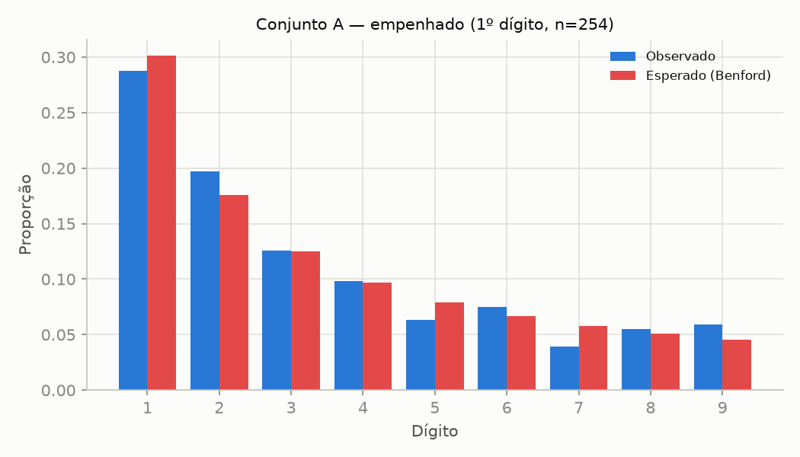
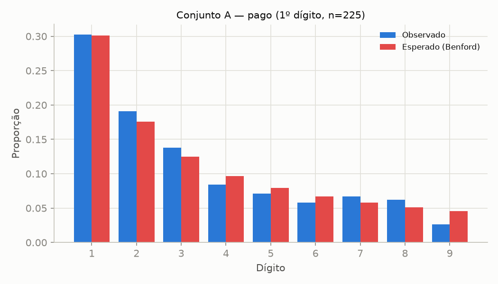
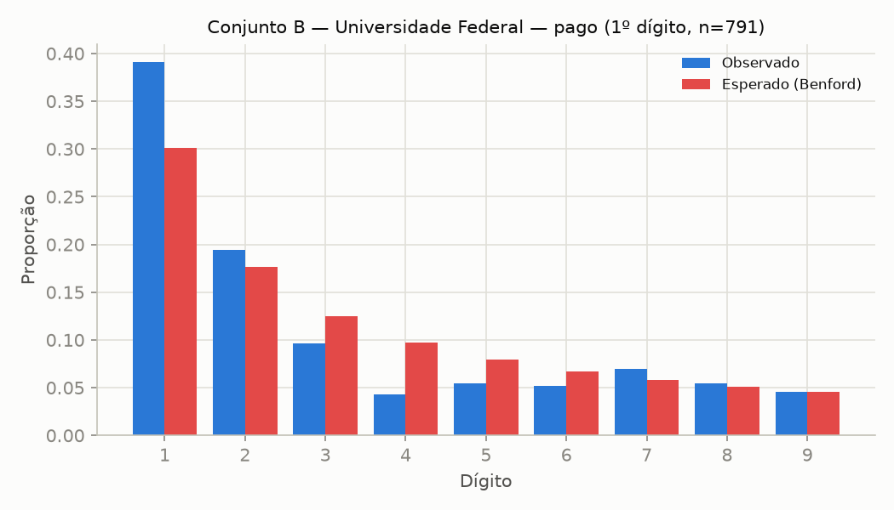
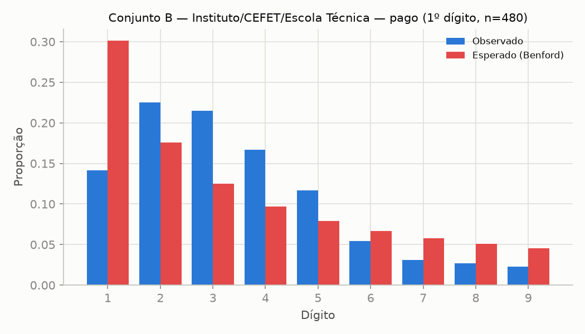

# Lei de Benford — tarefa 2.2

Gerado por `analises/03_benford.py`. Base: `dados/*_v2.{csv,parquet}`,
excluindo o ano parcial (execução ainda incompleta distorceria a
distribuição de dígitos por truncamento artificial dos valores). Valores
**nominais** (`empenhado`/`pago`, não deflacionados — ver docstring do
script para a justificativa), filtrados para > R$ 1.000 (limiar do
ROADMAP; valores muito pequenos têm poucos algarismos significativos e
distorcem o teste).

Metodologia: qui-quadrado (conformidade estatística formal, sensível ao
tamanho da amostra) e MAD de Nigrini (classificação prática, menos
sensível ao tamanho da amostra — usada aqui como critério principal).
Amostras com menos de 300 valores são marcadas
como inconclusivas independentemente do resultado.

## 1. Conjunto A (funcional-programático)

| grupo                           |   n | amostra_suficiente   |   chi2 |   p_valor |     MAD | classificacao          |
|:--------------------------------|----:|:---------------------|-------:|----------:|--------:|:-----------------------|
| A · empenhado · primeiro dígito | 254 | NÃO (<300)           |    4.4 |    0.8154 | 0.01076 | Conformidade aceitável |
| A · empenhado · segundo dígito  | 254 | NÃO (<300)           |   15.3 |    0.0841 | 0.01773 | Não conformidade       |
| A · pago · primeiro dígito      | 225 | NÃO (<300)           |    4   |    0.8537 | 0.01084 | Conformidade aceitável |
| A · pago · segundo dígito       | 225 | NÃO (<300)           |    7   |    0.64   | 0.01368 | Não conformidade       |

**Leitura — achado desta tarefa: a amostra do Conjunto A é insuficiente
para conclusão, nas quatro combinações.** Depois do filtro > R$ 1.000, só
restam 225–254 valores
por grupo (o Conjunto A tem ~81% de zeros nas colunas monetárias — ver
`relatorios/01_qualidade.md` — e a maior parte do que resta em cada
programa/ação é justamente pequena), abaixo do limiar de 300 adotado. O
primeiro dígito aparenta conformidade (MAD "aceitável") mas o segundo
dígito não ("Não conformidade") no mesmo par de colunas — direção
inconsistente entre os dois testes é o padrão típico de uma amostra
subdimensionada, não um sinal confiável de conformidade real. **Conclusão
desta seção: o Conjunto A, do jeito que está agregado hoje (uma linha por
ano×programa×ação), não tem volume suficiente para o teste de Benford ser
informativo.** Uma alternativa para uma iteração futura seria aplicar o
teste sobre lançamentos individuais de despesa (`/despesas/documentos`,
tarefa 3.1), que têm muito mais linhas que o painel agregado atual.

## 2. Conjunto B, por tipo de instituição

| grupo                                                      |   n | amostra_suficiente   |   chi2 |   p_valor |     MAD | classificacao    |
|:-----------------------------------------------------------|----:|:---------------------|-------:|----------:|--------:|:-----------------|
| B · Universidade Federal · empenhado · 1º dígito           | 791 | sim                  |   49.2 |    0      | 0.02476 | Não conformidade |
| B · Universidade Federal · pago · 1º dígito                | 791 | sim                  |   62.5 |    0      | 0.02733 | Não conformidade |
| B · Instituto/CEFET/Escola Técnica · empenhado · 1º dígito | 480 | sim                  |  139.1 |    0      | 0.05132 | Não conformidade |
| B · Instituto/CEFET/Escola Técnica · pago · 1º dígito      | 480 | sim                  |  128.5 |    0      | 0.05462 | Não conformidade |
| B · Outros / Administração · empenhado · 1º dígito         |  36 | NÃO (<300)           |   83.6 |    0      | 0.15533 | Não conformidade |
| B · Outros / Administração · pago · 1º dígito              |  36 | NÃO (<300)           |   44.3 |    0      | 0.1131  | Não conformidade |
| B · Hospitalar (EBSERH) · empenhado · 1º dígito            |  24 | NÃO (<300)           |    8   |    0.4309 | 0.0544  | Não conformidade |
| B · Hospitalar (EBSERH) · pago · 1º dígito                 |  24 | NÃO (<300)           |   11.3 |    0.1877 | 0.06929 | Não conformidade |
| B · Educação Básica · empenhado · 1º dígito                |  12 | NÃO (<300)           |   32.4 |    0.0001 | 0.13681 | Não conformidade |
| B · Educação Básica · pago · 1º dígito                     |  12 | NÃO (<300)           |   36.8 |    0      | 0.14698 | Não conformidade |
| B · CAPES · empenhado · 1º dígito                          |  12 | NÃO (<300)           |   24.7 |    0.0018 | 0.14244 | Não conformidade |
| B · CAPES · pago · 1º dígito                               |  12 | NÃO (<300)           |   14   |    0.0831 | 0.1054  | Não conformidade |
| B · Fundo (FNDE/FIES) · empenhado · 1º dígito              |  12 | NÃO (<300)           |   45.6 |    0      | 0.13317 | Não conformidade |
| B · Fundo (FNDE/FIES) · pago · 1º dígito                   |  12 | NÃO (<300)           |   31.2 |    0.0001 | 0.14032 | Não conformidade |

**Leitura:** 10 de 14 combinações
tipo×coluna têm amostra insuficiente (<300) — a
maioria dos tipos de instituição (`CAPES`, `Fundo (FNDE/FIES)`, `Educação
Básica`, `Hospitalar (EBSERH)`) tem poucos órgãos e poucos anos, logo,
poucas dezenas de observações; **essas linhas são explicitamente
inconclusivas, não "não conformes"**, mesmo com qui-quadrado
estatisticamente significativo em vários casos — significância não supre
tamanho de amostra na classificação MAD adotada aqui.

Os dois grupos bem-dimensionados (`Universidade Federal`, n=791;
`Instituto/CEFET/Escola Técnica`, n=480) têm resultado conclusivo: **não
conformidade em ambos**, com o mesmo padrão nos dois — excesso do dígito 1
(observado 39,1% vs. 30,1% esperado em Universidade Federal) e déficit dos
dígitos 3–4 (9,6%/4,3% vs. 12,5%/9,7% esperado). A leitura mais provável
não é manipulação, e sim uma característica estrutural do Conjunto B: cada
linha é o **orçamento total anual de uma instituição do mesmo tipo**, uma
grandeza que tende a se concentrar numa faixa de magnitude relativamente
estreita (a maioria das universidades federais tem orçamento na casa das
centenas de milhões a poucos bilhões de reais) — Benford pressupõe valores
espalhados por várias ordens de grandeza, condição que totais
institucionais homogêneos violam por construção, não por fraude. Ver
gráficos para esses dois grupos.

## 3. Limitações do teste nesta aplicação

- Benford funciona melhor sobre valores de transações individuais
  cobrindo várias ordens de grandeza; aqui os "valores" são totais
  agregados (por ano×programa×ação ou por ano×órgão), não lançamentos
  contábeis individuais — desvios podem refletir a estrutura de agregação
  (ex.: poucos programas dominando o total, como visto na tarefa 2.1), não
  necessariamente manipulação.
- Não conformidade indica **prioridade para investigação com outras
  fontes** (Fase 3: documentos de despesa individuais, contratos), nunca
  conclusão de irregularidade por si só.
