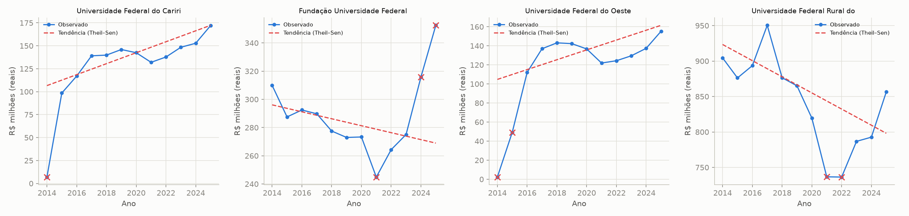

# Séries temporais por instituição — tarefa 2.4

Gerado por `analises/05_series.py`. Base: Conjunto B (`despesas_por_instituicao_v2`),
excluindo ano parcial. 111 instituições têm ≥8 anos
elegíveis (critério do ROADMAP) e entraram na análise. Método: tendência
robusta de Theil–Sen sobre `pago_real` por instituição; resíduo
padronizado pelo desvio robusto (MAD × 1,4826) dos próprios resíduos;
eventos = |resíduo padronizado| > 2.5.

## 1. Eventos detectados

40 eventos no total (mostrando até 50, ordenados por
desvio absoluto).

| orgao                                                        | tipo_instituicao               |   ano |   pago_real_mi |   desvio_padronizado |   n_anos_serie |
|:-------------------------------------------------------------|:-------------------------------|------:|---------------:|---------------------:|---------------:|
| Universidade Federal do Cariri                               | Universidade Federal           |  2014 |           6.96 |                -7.93 |             12 |
| Fundação Universidade Federal do Vale do São Francisco       | Universidade Federal           |  2025 |         352.5  |                 7.82 |             12 |
| Universidade Federal do Oeste da Bahia                       | Universidade Federal           |  2014 |           2.31 |                -5.95 |             12 |
| Universidade Federal Rural do Rio de Janeiro                 | Universidade Federal           |  2021 |         736.75 |                -4.21 |             12 |
| Instituto Federal de Educação, Ciência e Tecnologia do Sul d | Instituto/CEFET/Escola Técnica |  2025 |         428.39 |                 4.16 |             12 |
| Fundação Universidade Federal do Vale do São Francisco       | Universidade Federal           |  2024 |         315.84 |                 4.15 |             12 |
| Universidade Federal do Sul da Bahia                         | Universidade Federal           |  2014 |           0.45 |                -4    |             12 |
| Fundação Universidade Federal do Acre                        | Universidade Federal           |  2025 |         496.21 |                 3.96 |             12 |
| Universidade Federal da Fronteira Sul                        | Universidade Federal           |  2025 |         391.85 |                 3.84 |             12 |
| Universidade Federal Rural do Rio de Janeiro                 | Universidade Federal           |  2022 |         736.39 |                -3.78 |             12 |
| Universidade Federal do Oeste da Bahia                       | Universidade Federal           |  2015 |          49.27 |                -3.52 |             12 |
| Fundação Universidade do Maranhão                            | Universidade Federal           |  2025 |        1202.29 |                 3.3  |             12 |
| Universidade Federal de Ouro Preto                           | Universidade Federal           |  2025 |         590.26 |                 3.26 |             12 |
| Fundação Universidade Federal do Vale do São Francisco       | Universidade Federal           |  2021 |         244.9  |                -3.18 |             12 |
| Hospital de Clínicas de Porto Alegre                         | Hospitalar (EBSERH)            |  2017 |        2114.57 |                 3.14 |             12 |
| Universidade Federal de Ouro Preto                           | Universidade Federal           |  2021 |         502.74 |                -3.13 |             12 |
| Fundação Coordenação de Aperfeiçoamento de Pessoal de Nível  | CAPES                          |  2015 |       12510.3  |                 3.11 |             12 |
| Ministério da Educação - Unidades com vínculo direto         | Outros / Administração         |  2025 |        1617.24 |                 3.04 |             12 |
| Fundação Universidade de Brasília                            | Universidade Federal           |  2014 |        3096.42 |                 3.01 |             12 |
| Empresa Brasileira de Serviços Hospitalares                  | Hospitalar (EBSERH)            |  2014 |        1032.4  |                -2.95 |             12 |
| Instituto Federal de Educação, Ciência e Tecnologia do Rio G | Instituto/CEFET/Escola Técnica |  2025 |         941.69 |                 2.92 |             12 |
| Fundação Universidade Federal do Acre                        | Universidade Federal           |  2021 |         385.23 |                -2.91 |             12 |
| Universidade Federal da Integração Latino-Americana          | Universidade Federal           |  2025 |         288.82 |                 2.9  |             12 |
| Universidade Federal de Campina Grande                       | Universidade Federal           |  2017 |        1119.46 |                 2.88 |             12 |
| Fundação Universidade de Brasília                            | Universidade Federal           |  2025 |        2399.44 |                 2.83 |             12 |
| Universidade Federal de Campina Grande                       | Universidade Federal           |  2025 |         955.48 |                 2.82 |             12 |
| Universidade Federal de Alfenas                              | Universidade Federal           |  2021 |         272.89 |                -2.81 |             12 |
| Fundação Universidade Federal de São João Del-Rei            | Universidade Federal           |  2021 |         378.05 |                -2.8  |             12 |
| Universidade Federal de Ouro Preto                           | Universidade Federal           |  2022 |         501.27 |                -2.74 |             12 |
| Universidade Federal de Alfenas                              | Universidade Federal           |  2022 |         272.99 |                -2.74 |             12 |
| Universidade Federal do Sul e Sudeste do Pará                | Universidade Federal           |  2014 |          68.71 |                -2.73 |             12 |
| Universidade Federal do Rio Grande do Norte                  | Universidade Federal           |  2017 |        2569.02 |                 2.72 |             12 |
| Fundação Universidade Federal de Sergipe                     | Universidade Federal           |  2025 |        1060.04 |                 2.68 |             12 |
| Fundação Joaquim Nabuco                                      | Outros / Administração         |  2017 |         193.15 |                 2.65 |             12 |
| Universidade Federal do Rio Grande do Norte                  | Universidade Federal           |  2025 |        2176.82 |                 2.61 |             12 |
| Fundação Joaquim Nabuco                                      | Outros / Administração         |  2025 |         144.51 |                 2.61 |             12 |
| Fundação Universidade Federal de Pelotas                     | Universidade Federal           |  2022 |         922.3  |                -2.59 |             12 |
| Fundação Universidade Federal de São João Del-Rei            | Universidade Federal           |  2025 |         444.08 |                 2.56 |             12 |
| Instituto Federal de Educação, Ciência e Tecnologia Catarine | Instituto/CEFET/Escola Técnica |  2017 |         502.46 |                 2.55 |             12 |
| Universidade Federal de Alfenas                              | Universidade Federal           |  2025 |         314.78 |                 2.51 |             12 |

## 2. Exemplos ilustrados

**Leitura dos gráficos:** linha sólida com marcadores é o valor real
observado; linha tracejada é a tendência de Theil–Sen (mediana das
inclinações entre todos os pares de anos — pouco sensível ao próprio
evento que está sendo detectado); "×" marca os anos sinalizados como
evento.

## 3. Comparação com `flag_salto_anual` (Fase 1)

Dos 40 eventos listados acima, apenas 1
também têm `flag_salto_anual=True` no mesmo ano/instituição (2%) —
sobreposição muito baixa, achado a registrar: os dois critérios praticamente
não se substituem, cada um captura uma fatia diferente dos casos, e nenhum
dos dois é redundante em relação ao outro para fins de priorização.
Os dois métodos capturam fenômenos relacionados mas não idênticos:
`flag_salto_anual` compara cada ano só com o ano anterior (sensível a
mudanças abruptas de curto prazo, mesmo que a série volte ao patamar
seguinte); o resíduo de Theil–Sen compara cada ano com a tendência de
**toda a série** (sensível a um ano fora do padrão de longo prazo, mesmo
que a variação ano a ano não pareça extrema isoladamente — ex.: um platô
alto de 3 anos seguido de volta ao normal pode não gerar
`flag_salto_anual` em nenhum ano individual, mas gera resíduo alto nos 3
anos do platô). Eventos capturados por só um dos dois métodos não são
menos importantes — são complementares.

## 4. Padrão já conhecido vs. achados novos

Quatro das instituições no topo da lista (Cariri, Oeste da Bahia, Sul da
Bahia, Sul e Sudeste do Pará, todas com evento em 2014, ocasionalmente
também 2015) são as universidades federais criadas na expansão de
2013–2014, já identificadas em `relatorios/02_eda.md` (seção 6) e
`relatorios/04_outliers.md` (seção 3): com 12 anos de histórico completo
hoje, elas passam no critério de ≥8 anos, mas o primeiro ano
(orçamento de implantação, uma fração do valor maduro) inevitavelmente
aparece como resíduo extremo em relação à tendência de 12 anos — efeito
estrutural conhecido, não achado novo.

Os demais eventos **não têm explicação estrutural identificada nos dados
já analisados** e são achados desta tarefa: destacam-se padrões de
oscilação em instituições já consolidadas (não recém-criadas), como
Universidade Federal Rural do Rio de Janeiro (queda sustentada 2019→2021,
recuperação parcial depois) e Fundação Universidade Federal do Vale do São
Francisco (queda até 2021, salto acentuado em 2024–2025) — ver painéis 2 e
4 da figura acima. Esses casos são prioridade para a consolidação da
tarefa 2.5.

## 5. Limitações

- Resultados desta tarefa alimentam a consolidação de casos da tarefa 2.5,
  junto com EDA (2.1), Benford (2.2) e outliers multivariados (2.3).
- Theil–Sen usa só o par (ano, valor) — não considera taxa de execução,
  porte da instituição ou contexto orçamentário; um resíduo alto é
  candidato a checagem manual, não conclusão sobre a causa.
